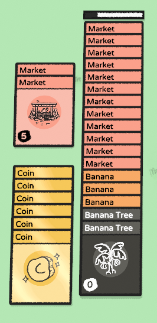

# Stacklands Tweaks

Some tweaks make Stacklands automation easier.

## Market boost

`Market` card can be stacked up to 12 and gains selling speed boost by the amount of top `Market` cards.

**NOTE** `Market` card can't sell itself anymore.

## GameModLoader.LoadModBlueprint() bug fix

Original method does not apply `Subprint.CardsToRemove`, instead, it's picked from `Subprint.RequiredCards` as its final value.

## To implement

- [ ] Boosted `Campfire`
